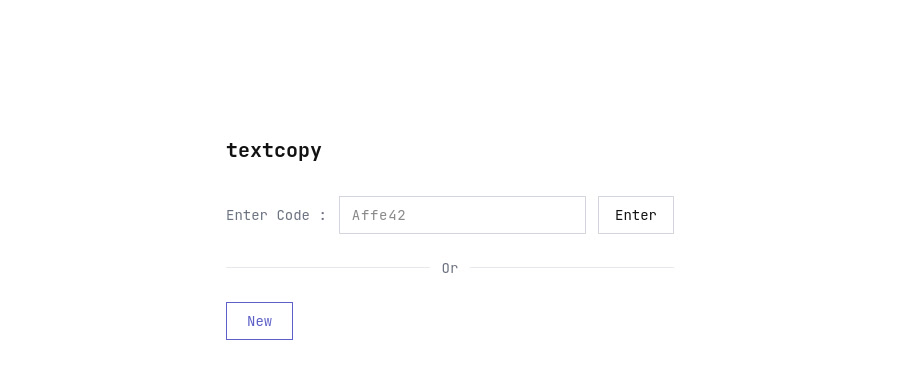
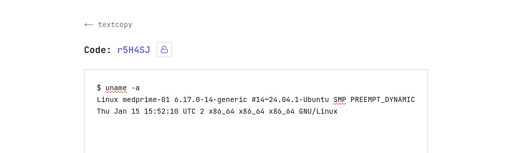
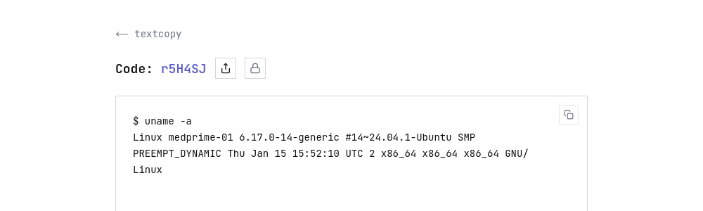

# textcopy

Share text between devices using a short code. No accounts, no sign-ups.

One person writes text, gets a 6-character code. Another person enters the code, sees the text. That's it.



Create a new entry or enter an existing code to retrieve shared text.



Write or edit your text. Every entry gets a unique short code.



Share the code with anyone. They see the text instantly — no login required.

## How it works

1. Click **New** to create an entry. You get a unique code.
2. Write your text and hit **Save**.
3. Share the code. Anyone with it can view the text.
4. Entries expire automatically after **60 minutes**.

## Quick start

### Docker (recommended)

```bash
docker compose up --build
```

Open [http://localhost:8080](http://localhost:8080).

### Local development

**Prerequisites:** Go 1.25+, Node.js 22+

```bash
# Build the frontend
cd frontend && npm install && npm run build && cd ..

# Run the server
go run main.go
```

Open [http://localhost:8080](http://localhost:8080).

For frontend development with hot reload:

```bash
cd frontend && npm run dev
```

This starts the Next.js dev server on [http://localhost:3000](http://localhost:3000).

## API

All text values are stored and transmitted as **base64-encoded** strings. The API accepts and returns JSON.

| Method | Endpoint | Description |
|--------|---------------------|--------------------------------------|
| POST | `/api/texts` | Create a new entry. Returns `{code}` |
| PUT | `/api/texts/{code}` | Update text for an existing code |
| GET | `/api/texts/{code}` | Retrieve text by code |
| GET | `/api/hello` | Health check |

### Create

```bash
curl -X POST http://localhost:8080/api/texts
```
```json
{"code": "r1SA9K"}
```

### Update

```bash
curl -X PUT http://localhost:8080/api/texts/r1SA9K \
  -H "Content-Type: application/json" \
  -d '{"text": "SGVsbG8gV29ybGQ="}'
```
```json
{"code": "r1SA9K"}
```

### Read

```bash
curl http://localhost:8080/api/texts/r1SA9K
```
```json
{"code": "r1SA9K", "text": "SGVsbG8gV29ybGQ="}
```

## Architecture

```
textcopy/
├── main.go              # Go server — API + static file serving
├── go.mod
├── frontend/            # Next.js app (static export)
│   ├── src/app/
│   │   ├── page.tsx     # Home — enter code or create new
│   │   ├── view/        # View text (read-only)
│   │   └── edit/        # Edit text
│   └── next.config.ts
├── Dockerfile           # Multi-stage build
└── docker-compose.yml
```

**Backend:** Single Go binary, zero external dependencies. Text is stored in-memory using a concurrent map. A background goroutine sweeps expired entries every minute.

**Frontend:** Next.js with static export served by the Go server. Styled with Tailwind CSS using a minimal monospace theme.

## Configuration

| Variable | Default | Description |
|-------------|-----------------|--------------------------------------|
| `PORT` | `8080` | Server listen port |
| `STATIC_DIR`| `./frontend/out`| Path to the frontend static build |

## Disclaimer

This project was developed with the assistance of AI-powered code generation tools. While the code has been reviewed and tested, users should exercise their own judgement when deploying to production environments.

## License

MIT
